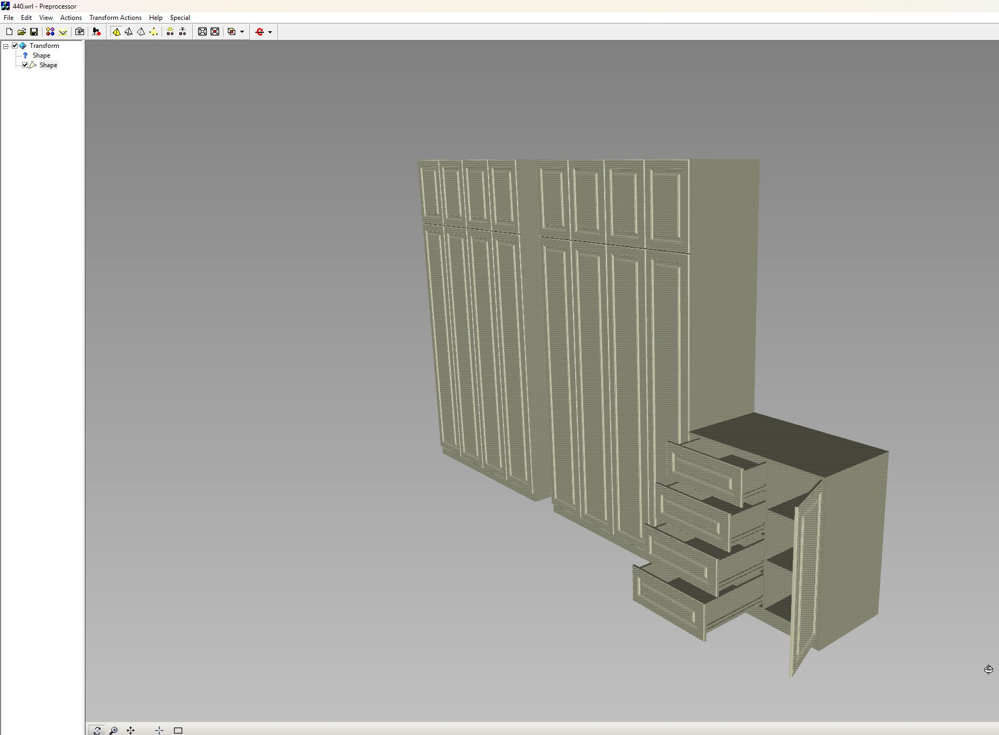

# stl2wrl - Convert an STL file to VRML/WRL

Useful for converting basic STL objects to Virtual Reality Modeling Language (VRML/WRL) files in KiCAD, Outline3D (or other programs).

## Recent Improvements

This version has been enhanced with:
- Full type annotations for all functions and methods
- Comprehensive English documentation for all functions and classes
- Improved error handling for file validation
- Support for both ASCII and binary STL files (with numpy-stl)

## Dependencies

For working with binary STL files, you need to install the following dependencies:
- numpy
- numpy-stl

### Installation

You can install them using pip:
```
pip install numpy numpy-stl
```

Or use the provided requirements.txt file:
```
pip install -r requirements.txt
```

### Installing from Test PyPI

To install the package from Test PyPI, use the following command:
```
pip install --index-url https://test.pypi.org/simple/ stl2wrl
```

### Python Version Compatibility

The numpy-stl library has different compatibility requirements based on your Python version:
- For Python < 3.9: numpy-stl version 2.11.0 to 3.1.2
- For Python >= 3.9: numpy-stl version 3.1.2 and above

For the K3 environment (Python 3.7 32-bit Windows only):
```
pip install numpy-stl==3.1.2 -U --target <UserProto>/site-packages
```

For ASCII STL files, no additional dependencies are required.

### Python 3.7 Support

For Python 3.7 environments, we provide Docker-based testing since GitHub Actions no longer supports this version. To test with Python 3.7:

```bash
docker build -t stl2wrl-py37 .
docker run stl2wrl-py37
```

## Performance Tests

Performance test results on a Windows 11 system with AMD Ryzen 7 5800H processor:

### Small model (zynq_chip.stl - 0.01 scale):
- Time: 1.38 seconds
- Command: `python stl2wrl.py demo\zynq_chip.stl 0.01`

### Large model (440.stl - 1.0 scale):
- Size: >150 MB *Due to the very large size of the model, the 440.stl file has not been added to the repository.*
- Time: 18.17 seconds
- Command: `python stl2wrl.py demo/440.stl 1`

## Example using a CLG400 footprint:
```
# 2.54 Scaling factor for mm/inch conversion
# Output is stored in demos/zynq_chip.wrl, ready to import into KiCAD
# Conversion may take ~30 seconds or longer for this model (Spec'd on M1 Macbook Air)
./stl2wrl.py demos/zynq_chip.stl 2.54
```

## KiCAD import


## Test model 440


## Contributors
- Original implementation by Bradley Boccuzzi
- Improvements by Alexander Dragunkin and SOURCECRAFT CODE assistant